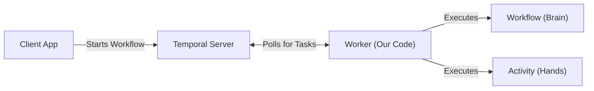
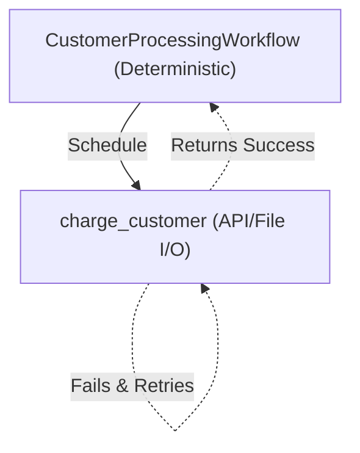
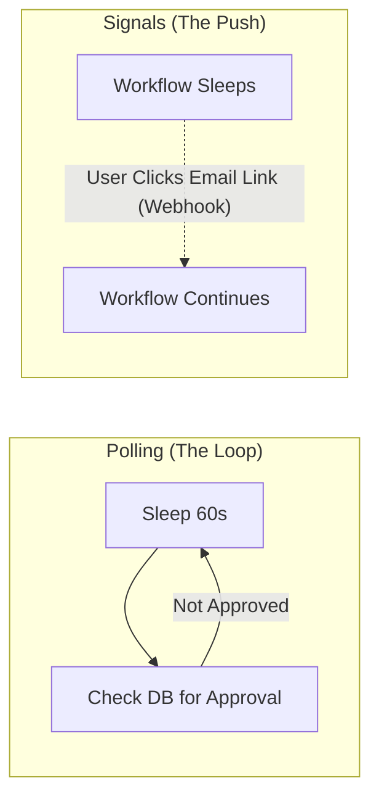
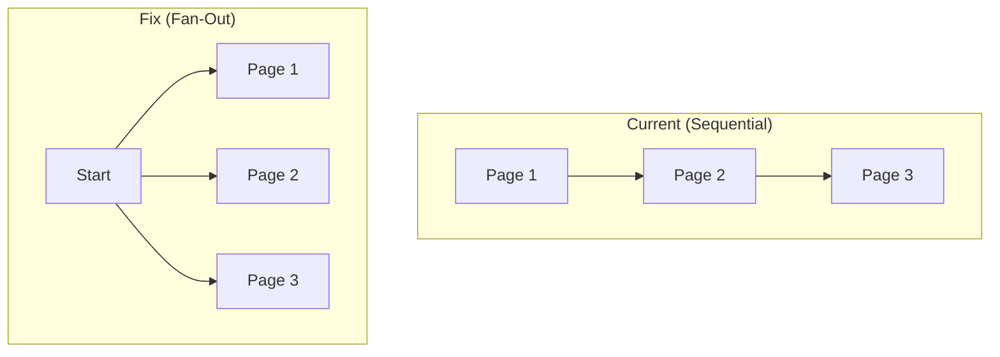

# Temporal in Practice: From Theory to "Vibe-Coding"

**Target Audience:** Engineers, Engineering Directors, Project Managers
**Goal:** Enable everyone to understand Temporal's core mechanics well enough to use AI coding tools effectively, debug confidently, and avoid catastrophic failures.

---

## 1. The Big Picture & The "Vibe-Coding" Era (10 mins)

### What is Temporal?
- **For PMs/Directors:** It's a system that guarantees your code finishes executing, no matter what goes wrong. If a server crashes, a third-party API goes down, or a database locks up, Temporal remembers exactly where it was and resumes automatically.
- **For Engineers:** It's a durable execution engine. It replaces complex state machines, message queues, and cron jobs with standard code.

### The IPS Ecosystem
Temporal is the silent engine powering our most critical applications:
- **Dex:** Document understanding and file management.
- **Agentx:** Agentic workflows and orchestration.
- **Other IPS Applications:** Handling complex, multi-step data processing pipelines.

### AI & Temporal: The "Vibe-Coding" Dilemma
- **The New Reality:** AI tools (Cursor, Copilot) write the bulk of our code. They are incredible at generating the "how" (the syntax).
- **The Danger:** Temporal has strict, unforgiving rules. LLMs will confidently hallucinate non-deterministic workflows or bundle API calls directly into workflow code.
- **The Modern Engineer's Job:** You are no longer just typing code; you are the architect and the reviewer. You must know the best practices for **Workflows, Activities, Workers, Task Queues, and Idempotency**.
- If you "vibe-code" Temporal without this foundation, you will generate code that looks correct locally but fails catastrophically in production.
- **Our Goal Today:** Equip you with the architectural intuition to guide AI effectively, spot its Temporal anti-patterns, and debug the results.

---

## 2. Scope & Boundaries (What we won't cover today) (5 mins)

To keep this session practical and actionable, we are intentionally skipping:
- **Advanced Infrastructure:** Server deployment, Kubernetes, Cassandra/Postgres tuning, cluster scaling.
- **Low-level SDK Internals:** gRPC protocols, Rust core state machines, history event pagination.
- **Dex/Agentx Internals:** We will look at *how* they use Temporal, but not their internal business logic or prompt engineering.
- **Advanced Customizations:** Custom interceptors, advanced data converters.

---

## 3. Introducing the Demo Scenario (5 mins)

**[🎬 CUE: Presenter switches to IDE to show the code structure]**

To explain these concepts, we are going to look at a very simple, relatable scenario: **A Pizza Delivery App.**

We have a full-stack demo in the `demo/` directory with a web UI for placing orders and a Temporal backend:
1. `demo/workflows.py`: Contains `PizzaOrderWorkflow` (the main orchestrator) and `KitchenWorkflow` (a child workflow).
2. `demo/activities.py`: Contains `charge_customer`, `prep_ingredients`, `bake_pizza`, `box_order`, and `deliver_order`. These simulate real work with delays and random failures.

The flow is: **Charge -> Kitchen (Prep -> Bake -> Box) -> Deliver**. We will use this code to explain the core concepts, and then we will run it live to see what happens when things go wrong.

**[🎬 CUE: Presenter switches back to Presentation Slides]**

---

## 4. Core Concepts Grounded in Reality (15 mins)

*Let's look at how these concepts work using our Demo code.*

### Workflows vs. Activities: The Golden Rules

**Workflows (The Orchestrator)**
- **Rule:** Must be 100% deterministic. 
  - *What does deterministic mean here?* It means if Temporal replays the workflow code from the beginning, it must take the exact same path and schedule the exact same activities in the exact same order. 
  - *Caveat:* An LLM call or API request is non-deterministic not just because the response might change, but because it might fail (network timeout, 500 error). If it fails during a replay, the workflow's execution path changes, breaking determinism.
  - Therefore: No network calls, no random numbers, no current time (unless using Temporal's time) directly inside the workflow.
- **Example (Demo):** `CustomerProcessingWorkflow`
  - It orchestrates the high-level logic. It decides *what* to do next and schedules the activities.

**Activities (The Workers)**
- **Rule:** Where the actual work happens. Side-effects are allowed (DB calls, API requests, file I/O).
- **Example (Demo):** `charge_customer`
  - It actually talks to the payment gateway (or in our case, writes to a file). If it fails, Temporal retries it automatically.

### Idempotency: The Secret to Safe Retries

Because Temporal retries failed activities, your activities **must** be safe to run multiple times.

- **The Bad (Demo Example):** Our `charge_customer` activity.
  - *Why it's dangerous:* It blindly appends a charge to `charges.txt` and then randomly fails. When Temporal retries it, it appends *another* charge. The customer gets double-charged!
- **The Good (How we fix it):** 
  - *The Fix:* We pass a unique `transaction_id` to the activity. Before writing to the file (or database), we check: "Have I already processed this transaction ID?" If yes, return success immediately without charging again.

### Handling External Events: Signals vs. Polling

How do we wait for a human to approve a charge, or a 3rd party API to finish?

- **The Polling Approach:**
  - A `while` loop with `workflow.sleep()` that repeatedly checks a database to see if the user approved the charge.
  - *Pros:* Simple to implement. *Cons:* Can be inefficient and clutter history.
- **The Signal Approach:**
  - Workflows can expose a Signal endpoint (`@workflow.signal`). The workflow pauses indefinitely. When the user clicks "Approve" in their email, the backend sends a webhook to Temporal, waking up the workflow immediately.

---

## 5. Interactive Live Debugging Demo (20 mins) - *The Centerpiece*

**[🎬 CUE: Presenter switches to IDE and Terminal]**

**The Setup:**
We will now run the workflow we just discussed. It contains three intentional, very common bugs. **This is exactly the kind of code an LLM will generate by default if you don't prompt it carefully.**

**[🎬 CUE: Presenter runs `just broken` and opens the Pizza UI]**
**[🎬 CUE: Presenter places an order through the UI, then switches to Temporal Web UI]**

### Bug 1: The Sandbox Restriction (`RestrictedWorkflowAccessError`)
- The workflow uses `import uuid` at the top of the file and calls `uuid.uuid4()` inside the workflow.
- Temporal's Python SDK has a **sandbox** that detects non-deterministic calls and blocks them immediately.
- The workflow fails with: `RestrictedWorkflowAccessError: Cannot access uuid.uuid4.__call__ from inside a workflow.`
- **The Naive Fix (and why it's dangerous):** Someone might say "just move the import into `workflow.unsafe.imports_passed_through()`". This bypasses the sandbox -- the error disappears, and the workflow appears to work. But we have just silenced a safety mechanism.

### Bug 2: The Non-Determinism (`NonDeterministicWorkflowError`)
- After bypassing the sandbox, `uuid.uuid4()` runs fine the first time. But when the workflow replays (e.g., after the worker restarts), it generates a *different* UUID, causing the replay to diverge.
- The workflow now fails with: `NonDeterministicWorkflowError`
- **The Real Fix:** Replace `uuid.uuid4()` with `workflow.uuid4()`, which returns a deterministic UUID seeded from the workflow's event history.

### Bug 3: The Idempotency Bug (Double Charging)
- The `charge_customer` activity blindly appends to `charges.txt` and randomly fails 50% of the time.
- When Temporal retries the activity, the customer gets charged again. Check `charges.txt` to see duplicate entries.
- **The Fix:** Pass the `order_id` to the activity and check if it was already processed before writing.

**[🎬 CUE: Presenter live-fixes the code, restarts with `just fixed`]**
- Show how Temporal seamlessly recovers and continues exactly where it left off without losing data.

---

## 6. IPS Implementation Critique & Best Practices (10 mins)

*A blameless review of existing IPS code across different applications. Think of these not just as past mistakes, but as **default AI behaviors** that you, as the architect, must learn to spot and correct during PR reviews.*

### Critique 1: Sequential Activity Execution (Failing to Fan-Out)

- **Location:** `sjc_judicial_assistant` (`DocumentSplittingWorkflow`)
- **The Issue:** The workflow executes an activity (`detect_page_boundary`) inside a sequential `for` loop over every page of a document. For a 100-page document, it waits for each activity to finish before scheduling the next, taking 100x longer than necessary.
- **The Fix:** Temporal is designed for massive concurrency. Use `workflow.start_activity_method` (or `execute_activity` without awaiting immediately) and `asyncio.gather` to fan-out and run all page boundary detections in parallel.

### Critique 2: Swallowing Exceptions in Workflows
- **Location:** `moj-sak` (`Tier1ValidationWorkflow`)
- **The Issue:** The workflow wraps its entire execution in a `try...except Exception as e:` block, logs the error, and returns a string like `"❌ Validation failed"`. 
- **The Fix:** This is an anti-pattern. By catching the exception and returning normally, the workflow execution is marked as "Completed" (Success) in Temporal. This bypasses Temporal's native failure states and retry policies. You should let `ActivityError`s bubble up so the workflow can be properly marked as Failed or retried by Temporal.

### Critique 3: Lack of Idempotency in Database Writes
- **Location:** `moehe_ai_tutor` (`persist_lpg_messages` activity)
- **The Issue:** The activity iterates over a list of messages and blindly calls `dao.add_chat_message` to insert them into the database. If the activity fails midway or times out returning the result, Temporal will retry it, resulting in duplicate chat messages in the database.
- **The Fix:** Pass a unique deduplication key (like a generated message ID) to the activity, and use `INSERT ... ON CONFLICT DO NOTHING` in the database layer to ensure the activity is safe to retry.

### Critique 4: Passing Large Payloads in Event History
- **Location:** `moehe_ai_tutor` (`LPGTurnWorkflow.run`)
- **The Issue:** The workflow passes the entire `conversation` history (a large list of dictionaries) and `plan_dict` (a large JSON object) directly as arguments to the `run_lpg_turn` activity.
- **The Fix:** Temporal records all workflow and activity arguments in its Event History. Passing large payloads bloats the history, slows down replay, and can hit Temporal's size limits. Best practice is to pass a reference (like a database ID or S3 URI) and have the activity fetch the large payload itself.

### Critique 5: Redundant Wait Conditions
- **Location:** `council_of_ministers` (`ValidationWorkflow`)
- **The Issue:** The code sets `self._complete_task = True` and immediately on the next line calls `await workflow.wait_condition(lambda: self._complete_task, timeout=None)`.
- **The Fix:** This shows a misunderstanding of Temporal's event loop. Because the variable is set synchronously on the line above, the `wait_condition` will instantly resolve. It is completely redundant and should be removed.

---

## 7. FAQ & Common Questions (5 mins)

**Q: When should we use a separate Child Workflow instead of putting all activities in the main workflow?**
- **Event History Limits:** Temporal has strict limits on the size of a workflow's Event History. If a process loops over thousands of items, putting them all in the main workflow will cause it to crash. A Child Workflow keeps the main history clean.
- **Complexity & Encapsulation:** If a specific step in your business process is highly complex and involves multiple sub-steps (like our `KitchenWorkflow`), it is cleaner to encapsulate it.
- **Reusability:** If a sequence of activities is used across multiple different workflows, making it a Child Workflow allows you to reuse that exact orchestration logic.

**Q: Can I use `datetime.now()` in a workflow?**
- **No.** It is non-deterministic. If the workflow replays tomorrow, `datetime.now()` will return a different value, breaking the replay. You must use `workflow.now()` which returns the deterministic time recorded in the event history.
- *Pro-tip:* This is the #1 most common hallucination Copilot/Cursor makes when writing Temporal workflows. Always `Ctrl+F` for `datetime.now()` when reviewing AI-generated Temporal code.

---

## 8. Q&A (5 mins)

- Open floor for questions.
- Resources for further reading (Temporal docs, internal Notion pages).